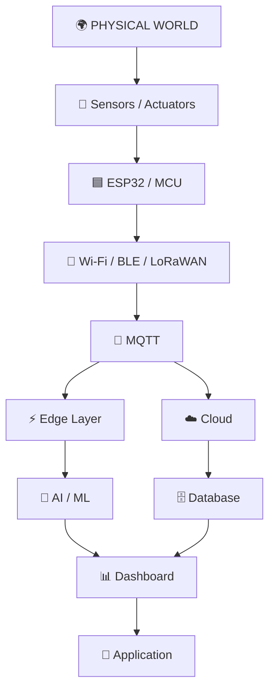
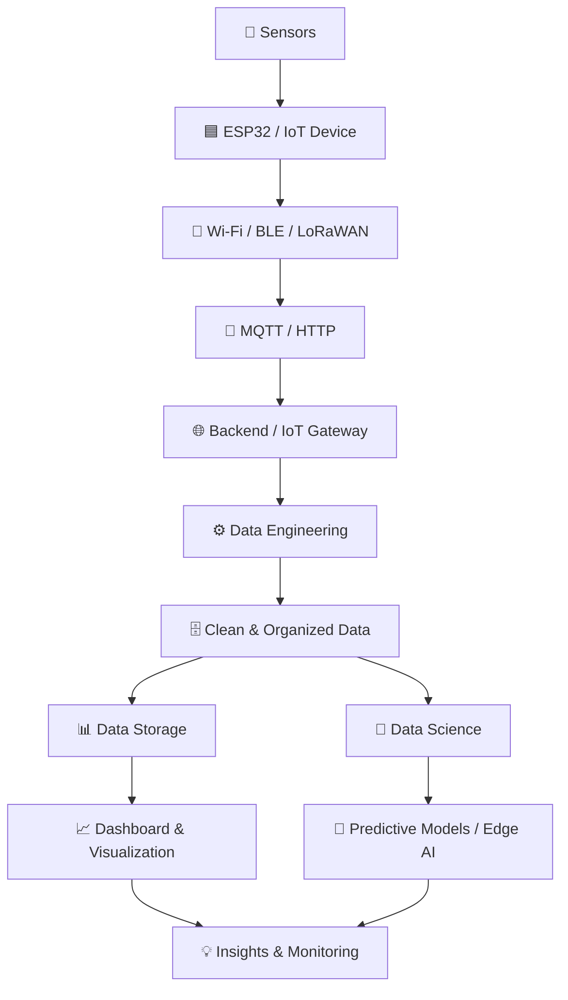

# 🌐 IoT Roadmap

> A structured roadmap to learn **Internet of Things (IoT)** from the fundamentals of electronics and embedded systems to advanced topics such as **Cloud IoT, Edge Computing, TinyML, and Industrial IoT**.

## IoT Architecture

After completing this roadmap, you should be able to understand and eventually build systems following an architecture such as:



This roadmap is divided into **three levels**:

* 🟢 **Beginner** — Build the fundamental hardware, programming, and networking knowledge.
* 🟡 **Intermediate** — Build connected IoT systems and understand communication, backend, databases, and cloud platforms.
* 🔴 **Advanced** — Learn security, edge computing, TinyML, industrial IoT, and large-scale IoT architecture.

---

## 🟢 Beginner Level

| Topic                                | Resources                                                                                                     |
| ------------------------------------ | ------------------------------------------------------------------------------------------------------------- |
| 🔌 **IoT Fundamentals**              | 📄 [AWS – How AWS IoT Works](https://docs.aws.amazon.com/iot/latest/developerguide/aws-iot-how-it-works.html)<br> 🎥 [Playlist - Internet of Things - IoT Tutorial for Beginners](https://youtube.com/playlist?list=PL9ooVrP1hQOGccfBbP5tJWZ1hv5sIUWJl&si=B17IPmbilPv_YwaL) [Coursera - IoT (Internet of Things) Wireless & Cloud Computing Emerging Technologies](https://www.coursera.org/learn/iot-wireless-cloud-computing) |
| ⚡ **Basic Electronics**              | 📖 [All About Circuits – Free Textbook](https://www.allaboutcircuits.com/textbook/) |
| 🔢 **Digital Electronics**           | 📖 [All About Circuits – Digital Circuits](https://www.allaboutcircuits.com/textbook/digital/) |
| 💻 **C/C++ Fundamentals**            | 🎓 [LearnCpp](https://www.learncpp.com/)<br> 🎥 [PLaylist - C programming MIT](https://youtube.com/playlist?list=PLo7g9OE1yqEKY4KxAiPpqA9gp7XOcPQ2V&si=SIY4YsSZxo-n5bd2)<br> 📄 [GeeksForGeeks - C++ Programming Language](https://www.geeksforgeeks.org/cpp/c-plus-plus/)<br> 📄 [w3schools - C++ Introduction](https://www.w3schools.com/cpp/cpp_intro.asp) |
| 🧠 **Embedded Systems Fundamentals** | 📄 [Embedded Systems – ARM Education](https://www.arm.com/resources/education)<br> 🎥 [MaharaTech - Embedded Systems](https://maharatech.gov.eg/course/index.php?categoryid=309)<br> 🎥 [Coursera - Introduction to the Internet of Things and Embedded Systems](https://www.coursera.org/learn/iot)<br> 🎥 [Foolish Engineer - Embedded Systems](https://youtube.com/playlistlist=PLbGlpmZLQWJceYTFXwBjYnUNN2vyVKYNA&si=NIFZrL1RyQCqw4l-) |
| 🤖 **Arduino Fundamentals**          | 📄 [Arduino Documentation](https://docs.arduino.cc/)<br> 🎥 [Arafa Microsy - Arduino كورس اردوينو](https://youtube.com/playlist?list=PLa4kqtM7SuFwpY8omRT32RK8kw1hDIGJ3&si=FAFJnbeCxH7q1sOI)<br> 📄 [GeeksForGeeks - Arduino Coding Basics](https://www.geeksforgeeks.org/electronics-engineering/arduino-coding-basics/)<br> 🎥 [Coursera - An Introduction to Programming the Internet of Things (IOT) Specialization](https://www.coursera.org/specializations/iot)|
| 🧪 **Arduino Projects**              | 📖 [Arduino Tutorials](https://docs.arduino.cc/tutorials/)<br> 🎥 [Playlist - Arduino Projects](https://youtube.com/playlist?list=PLKASro0L7R2XA4I8bJpARx9vq9hSyos7l&si=5OKvTlIprkyJJ3ti) |
| 🔧 **Sensors & Actuators**           | 📖 [Arduino Documentation](https://docs.arduino.cc/)<br> 📄 [GeeksForGeeks - Difference between Sensor and Actuator](https://www.geeksforgeeks.org/electronics-engineering/difference-between-sensor-and-actuator/)<br> 🎥 [Playlist - Sensors And Actuator](https://youtube.com/playlist?list=PL91lquAVmESBqKLU0Tn5gRVXVyW5KLgCa&si=VlORpKvxQ9g0DJzH)<br> 🎥 [Coursera - Embedding Sensors and Motors Specialization](https://www.coursera.org/specializations/embedding-sensors-motors) |
| 🟦 **ESP32 Fundamentals**            | 📖 [Espressif – ESP32 Documentation](https://docs.espressif.com/projects/esp-idf/en/latest/esp32/)<br> 🎥 [Playlist - انترنت الأشياء - ESP32](https://youtube.com/playlist?list=PLUKyI8ySgdwrBECztHBOPhtHgB79BLgdJ&si=7Kfr3OsGlqT0zKMH)<br> 📄 [Tutorial - Intro to the ESP32](https://makeabilitylab.github.io/physcomp/esp32/esp32.html)            |
| 🛠️ **ESP-IDF**                      | 📖 [ESP-IDF Programming Guide](https://docs.espressif.com/projects/esp-idf/en/latest/esp32/get-started/)<br> 🎥 [Playlist - IoT Firmware Development with ESP32 and ESP-IDF](https://youtube.com/playlist?list=PL3bNyZYHcRSXm0mNZLiu5hj5ScufC_au9&si=2KoKZ_4J0qlr59Sg)<br> 🎥 [Playlist - ESP32 with ESP-IDF and Embedded C Step by Step](https://youtube.com/playlist?list=PLOYsAys6a6mmeowMVksJWEIzdKOBMh20q&si=4iWcmghXpijQ35Yy)      |
| 🌐 **Networking Fundamentals**       | 🎓 [Cisco Networking Basics](https://www.netacad.com/courses/networking-basics)                               |
| 🐧 **Linux Fundamentals**            | 🎓 [Linux Journey](https://linuxjourney.com/)<br> 🎥 [Playlist - Linux Course in Arabic](https://youtube.com/playlist?list=PLT98CRl2KxKHaKA9-4_I38sLzK134p4GJ&si=AoDwAHfJ--m3X2_F)<br> 📄 [GeeksForGeeks - Linux Tutorial](https://www.geeksforgeeks.org/linux-unix/linux-tutorial/) |

### 🎯 Beginner Projects

Build projects while learning instead of waiting until you finish the entire level.

1. 💡 LED + Push Button
2. 🌡️ Temperature & Humidity Monitor
3. 💡 Automatic Light Controller
4. 📏 Ultrasonic Distance Measurement
5. 🌐 ESP32 Web Server
6. 📱 ESP32 Bluetooth Sensor
7. 🌡️ ESP32 Environmental Monitoring System

> 💡 **Goal:** By the end of this level, you should be able to program a microcontroller, connect sensors and actuators, communicate through basic interfaces, and build a simple ESP32-based device.

---

## 🟡 Intermediate Level

> 💡 **Tip:** At this stage, move from **"a device that works"** to **"a device that communicates."**

| Topic                     | Resources                                                                                                                  |
| ------------------------- | -------------------------------------------------------------------------------------------------------------------------- |
| 🔌 **UART**               | 📖 [Arduino – Serial Communication](https://docs.arduino.cc/language-reference/en/functions/communication/serial/)         |
| 🔗 **I²C**                | 📖 [Arduino – Wire Library](https://docs.arduino.cc/language-reference/en/functions/communication/wire/)                   |
| ⚡ **SPI**                 | 📖 [Arduino – SPI Library](https://docs.arduino.cc/language-reference/en/functions/communication/SPI/)                     |
| 🚗 **CAN Bus**            | 📖 [Arduino CAN Library](https://docs.arduino.cc/libraries/can/)                                                           |
| 📡 **Wi-Fi**              | 📖 [ESP-IDF Wi-Fi Documentation](https://docs.espressif.com/projects/esp-idf/en/latest/esp32/api-guides/wifi.html)         |
| 🟦 **Bluetooth / BLE**    | 📖 [ESP-IDF Bluetooth Documentation](https://docs.espressif.com/projects/esp-idf/en/latest/esp32/api-reference/bluetooth/) |
| 📨 **MQTT Fundamentals**  | 🌐 [MQTT.org](https://mqtt.org/)<br> 📄 [GeeksForGeeks - Introduction of Message Queue Telemetry Transport Protocol (MQTT)](https://www.geeksforgeeks.org/computer-networks/introduction-of-message-queue-telemetry-transport-protocol-mqtt/)<br> 🎥 [Playlist - MQTT Essentials](https://youtube.com/playlist?list=PLRkdoPznE1EMXLW6XoYLGd4uUaB6wB0wd&si=div-lpgkgtFgR-7M) |
| 📨 **MQTT Essentials**    | 🎓 [HiveMQ MQTT Essentials](https://www.hivemq.com/mqtt-essentials/) |
| 🌍 **HTTP & REST APIs**   | 📄 [MDN – HTTP](https://developer.mozilla.org/en-US/docs/Web/HTTP)<br> 🎥 [Video - What is a REST API?](https://youtu.be/lsMQRaeKNDk?si=vCK5mKDHDIj_c9k-)<br> 📄 [testomat.io - HTTP API vs. REST API: What’s the Difference](https://testomat.io/blog/http-api-vs-rest-api-key-differences-explained/)<br> 📄 [Amazon API Gateway - Choose between REST APIs and HTTP APIs](https://docs.aws.amazon.com/apigateway/latest/developerguide/http-api-vs-rest.html) |
| 🐍 **Python for IoT**     | 🎓 [Python Official Tutorial](https://docs.python.org/3/tutorial/)<br> 📄 [GeeksForGeeks - Internet of Things with Python](https://www.geeksforgeeks.org/python/internet-of-things-with-python/)<br> 🎥 [Playlist - Python for IOT Basics](https://www.youtube.com/playlist?list=PLjtZnTDdmzGYvrHh_jXvENIvpttmy2ifT)<br> 📄 [TopCoder - Python in IoT(Internet of Things)](https://www.topcoder.com/thrive/articles/python-in-iot-internet-of-things) |
| 🖥️ **Raspberry Pi**      | 📄 [Raspberry Pi Documentation](https://www.raspberrypi.com/documentation/)<br> 📄 [OpenSource.com - What is a Raspberry Pi](https://opensource.com/resources/raspberry-pi)<br> 🎥 [YouTube Channel - Raspberry Pi](https://www.youtube.com/@raspberrypi/playlists) |
| 🚀 **FastAPI**            | 📄 [FastAPI Documentation](https://fastapi.tiangolo.com/)<br> 🎥 [FreeCodeCamp - FastAPI Course for Beginners](https://youtu.be/tLKKmouUams?si=bs__H-aQm2JQZE1g)<br> 🎥 [Corey Schafer - FastAPI Tutorials](https://youtube.com/playlist?list=PL-osiE80TeTsak-c-QsVeg0YYG_0TeyXI&si=p1QNe7cloy6u4as9) |
| 🗄️ **Databases**         | 🎓 [SQLBolt](https://sqlbolt.com/)<br> 📄 [AI2SQL - sqlbolt: Examples, How It Works, Best Practices](https://ai2sql.io/learn/sqlbolt)<br> 🎥 [FreeCodeCamp - Databases In-Depth – Complete Course](https://youtu.be/pPqazMTzNOM?si=BDo3o2Oi7ykcumin)<br> 📄 [GeeksForGeeks - Introduction to Database](https://www.geeksforgeeks.org/dbms/what-is-database/)<br> 📄 [Oracle - What Is a Database](https://www.oracle.com/database/what-is-database/)<br> 🎥 [Maharatech - Database Fundamentals](https://maharatech.gov.eg/course/view.php?id=740) |
| 📊 **IoT Dashboards**     | 📄 [Node-RED](https://nodered.org/)<br> 🎥 [playlist - Node Red in Arabic](https://youtube.com/playlist?list=PLLwOOaWvQWtNQvrtcCQfL76kLE-kh2Ob0&si=SMgI1WlAL9ikY7Q3)<br> 🎥 [playlist - Node-RED Tutorials](https://youtube.com/playlist?list=PLKYvTRORAnx6a9tETvF95o35mykuysuOw&si=npXMfc0xH8XuhQf6)<br> 📄 [IBM Developer - Node-RED](https://developer.ibm.com/components/node-red/) |
| 📈 **Data Visualization** | 📄 [Grafana Documentation](https://grafana.com/docs/)<br> 📕 [GitHub - grafana](https://github.com/grafana/grafana)<br> 🎥 [YouTube Channel - Grafana](https://www.youtube.com/@Grafana)<br> 🎥 [edureka - Grafana Tutorial For Beginners](https://youtu.be/w-c3KYKQQfs?si=8Sdv4AYdtEZcq1dH) |

### 🔄 Important IoT Architecture

At this stage, start thinking in terms of complete data pipelines:

### 🎯 Intermediate Projects

8. 📡 **ESP32 → MQTT → PC**
9. 🌡️ **IoT Environmental Monitoring System**
10. 📨 **ESP32 → MQTT → Python Backend**
11. 🗄️ **IoT Data Collection + Database**
12. 📊 **Real-Time IoT Dashboard**
13. 🏠 **Smart Home Prototype**
14. 🍓 **Raspberry Pi IoT Gateway**
15. 📡 **Multi-Device MQTT System**

> 💡 **Goal:** By the end of this level, you should be able to build an end-to-end IoT system where multiple devices collect data, communicate over a network, send data through an IoT protocol, store it, and visualize it.

---

## 🔴 Advanced Level

> 💡 **Tip:** Advanced IoT is not simply about connecting more sensors. It is about building systems that are **secure, scalable, reliable, intelligent, and capable of operating in real-world environments.**

| Topic                                 | Resources                                                                                                    |
| ------------------------------------- | ------------------------------------------------------------------------------------------------------------ |
| ⚙️ **RTOS Fundamentals**              | 📖 [FreeRTOS Documentation](https://www.freertos.org/)                                                       |
| 🧵 **FreeRTOS Programming**           | 📖 [FreeRTOS Kernel Documentation](https://www.freertos.org/Documentation/02-Kernel)                         |
| ☁️ **Cloud IoT Fundamentals**         | 📖 [AWS IoT Core Documentation](https://docs.aws.amazon.com/iot/)                                            |
| ☁️ **AWS IoT Core**                   | 🎓 [AWS IoT Getting Started](https://docs.aws.amazon.com/iot/latest/developerguide/iot-gs.html)              |
| 📨 **Cloud MQTT**                     | 📖 [AWS IoT Core – MQTT](https://docs.aws.amazon.com/iot/latest/developerguide/mqtt.html)                    |
| 🔐 **IoT Security**                   | 📖 [NIST – IoT Cybersecurity](https://www.nist.gov/itl/applied-cybersecurity/nist-cybersecurity-iot-program) |
| 🔑 **Authentication & Authorization** | 📖 [AWS IoT Security](https://docs.aws.amazon.com/iot/latest/developerguide/security.html)                   |
| 🔒 **TLS & Certificates**             | 📖 [AWS IoT Security](https://docs.aws.amazon.com/iot/latest/developerguide/iot-security.html)               |
| 🔄 **OTA Updates**                    | 📖 [AWS IoT Jobs](https://docs.aws.amazon.com/iot/latest/developerguide/iot-jobs.html)                       |
| 📡 **LoRaWAN**                        | 🌐 [LoRa Alliance](https://lora-alliance.org/)                                                               |
| 📶 **LoRaWAN Fundamentals**           | 📖 [The Things Network](https://www.thethingsnetwork.org/docs/lorawan/)                                      |
| ⚡ **Edge Computing**                  | 📖 [AWS – Edge Computing](https://aws.amazon.com/edge/)                                                      |
| 🤖 **TinyML**                         | 🎓 [Harvard TinyML Course](https://pll.harvard.edu/course/tiny-machine-learning)                             |
| 🧠 **Edge AI**                        | 📖 [Edge Impulse Documentation](https://docs.edgeimpulse.com/)                                               |
| 🏭 **Industrial IoT**                 | 📖 [NIST – Smart Manufacturing](https://www.nist.gov/programs-projects/smart-manufacturing)                  |
| 🔄 **Digital Twins**                  | 📖 [Microsoft – Azure Digital Twins](https://learn.microsoft.com/en-us/azure/digital-twins/)                 |
| 🏗️ **IoT System Architecture**       | 📖 [AWS IoT Architecture](https://docs.aws.amazon.com/wellarchitected/latest/iot-lens/welcome.html)          |

### ☁️ Cloud IoT Architecture

AWS IoT Core provides a useful example of how connected devices can communicate with cloud services. Its architecture includes device connectivity, a message broker, rules, device shadows, and integration with other AWS services.

```text
                ☁️ CLOUD
                   │
        ┌──────────┴──────────┐
        │                     │
    Database              AI / ML
        │                     │
        └──────────┬──────────┘
                   │
              IoT Platform
                   │
               MQTT / HTTPS
                   │
             🌐 Internet
                   │
              Edge Gateway
                   │
          ┌────────┴────────┐
          │                 │
       ESP32             Raspberry Pi
          │                 │
       Sensors           Sensors
```

AWS's current tutorials explicitly support learning paths from connecting a first device and exchanging MQTT messages through more advanced features such as rules, shadows, device management, and security testing.

### 🎯 Advanced Projects

16. ⚙️ **ESP32 + FreeRTOS Multi-Task System**
17. 🔐 **Secure AWS IoT Device**
18. ☁️ **ESP32 → AWS IoT Core → Database**
19. 🔄 **Secure OTA Firmware Update**
20. 📡 **LoRaWAN Sensor Network**
21. 🏭 **Industrial IoT Monitoring System**
22. 🧠 **Edge AI / TinyML Device**
23. 🔧 **Predictive Maintenance System**
24. 🪞 **IoT Digital Twin**
25. 🌐 **Scalable Multi-Device IoT Platform**

---

## 🧭 Recommended Learning Path

```text
🔌 Electronics Fundamentals
        ↓
💻 C/C++ Programming
        ↓
🧠 Embedded Systems
        ↓
🤖 Arduino
        ↓
🟦 ESP32 ⭐
        ↓
🌐 Networking
        ↓
🔌 UART / I²C / SPI / CAN
        ↓
📡 Wi-Fi / BLE
        ↓
📨 MQTT ⭐⭐⭐
        ↓
🐍 Python
        ↓
🚀 FastAPI / Backend
        ↓
🗄️ Databases
        ↓
📊 Node-RED / Grafana
        ↓
☁️ Cloud IoT ⭐⭐⭐
        ↓
🔐 IoT Security ⭐⭐⭐
        ↓
🔄 OTA / Device Management
        ↓
⚙️ RTOS / FreeRTOS
        ↓
📡 LoRaWAN / Cellular IoT
        ↓
⚡ Edge Computing
        ↓
🤖 TinyML / Edge AI ⭐⭐⭐
        ↓
🏭 Industrial IoT
        ↓
🪞 Digital Twins
        ↓
🏗️ IoT System Design
```

---


> 💡 **Final Tip:** IoT is an interdisciplinary field. You don't need to master every area equally. Build enough **electronics + embedded systems** knowledge to work with hardware, then develop stronger skills in **networking, software, cloud, security, and AI** according to your specialization.
